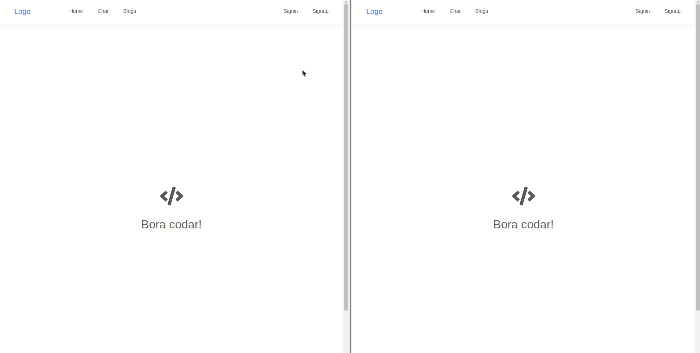

<h1 align="center">
  
</h1>

<h1>
  
</h1>

## 📝 Description

This challenge aims to build a real time chat, to demonstrate the connection between front-end and backend using websocket tool.

---

## 💻 Used Technologies

This challange has been done using the following technologies:

- [Node.js](https://nodejs.org/en/)
- [ReactJS](https://pt-br.reactjs.org/)
- [Socket.io](https://socket.io/)
- [MongoDB](https://www.mongodb.com/)
- [Redux](https://redux.js.org/)

---

## 📁 Download

To use this application, 

1. make dev.js file inside config folder 
2. put mongoDB info into dev.js file 
3. Type " npm install " inside the root directory ( Download Server Dependencies ) 
4. Type " npm install " inside the client directory ( Download Front-end Dependencies )

---

This challenge has been done with 💙 by José Renato Montagnana 👋🏻 [Keep in touch!](https://www.linkedin.com/in/joserenato-devfullstack/)
